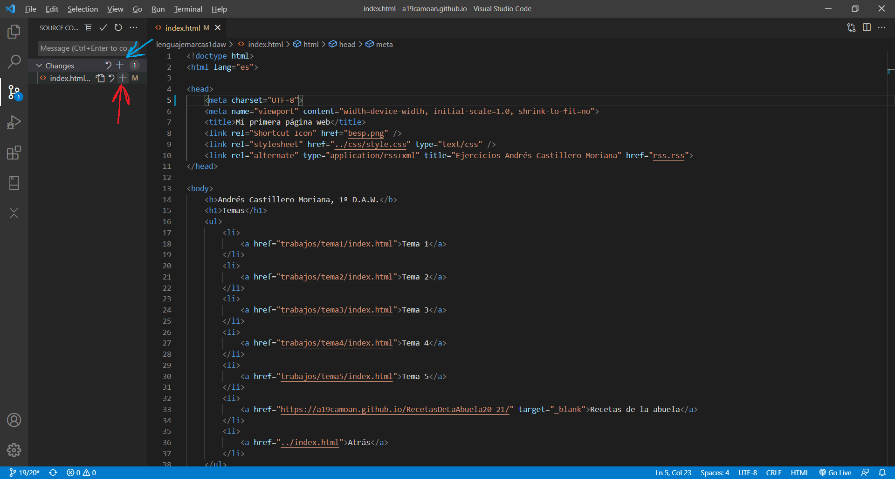
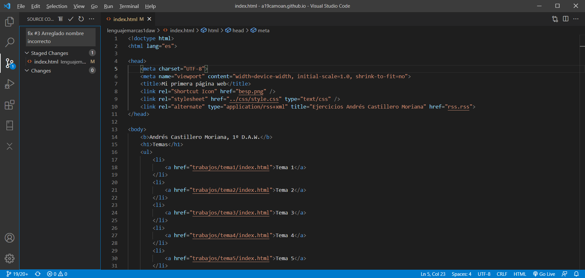
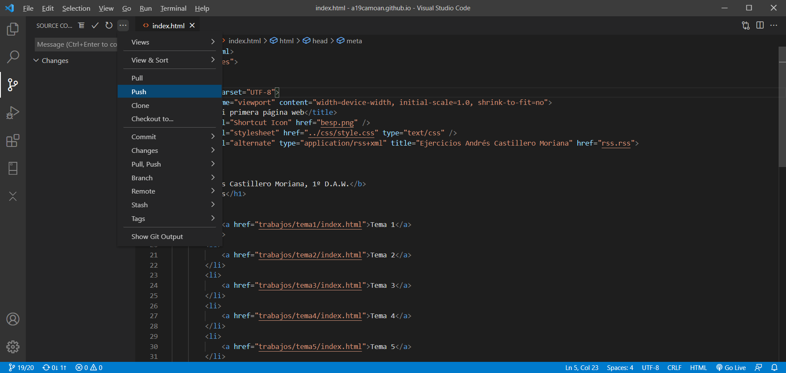
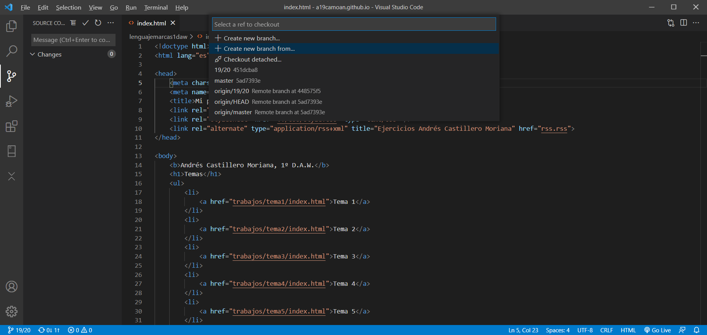
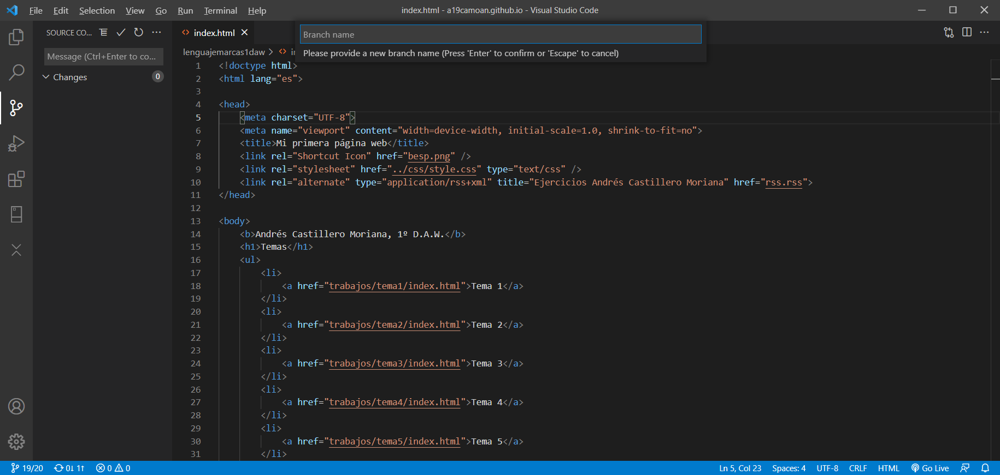
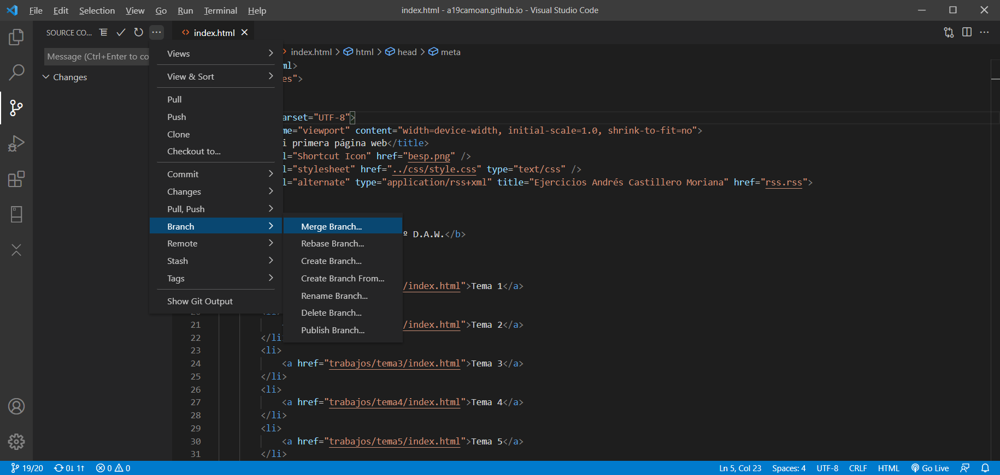
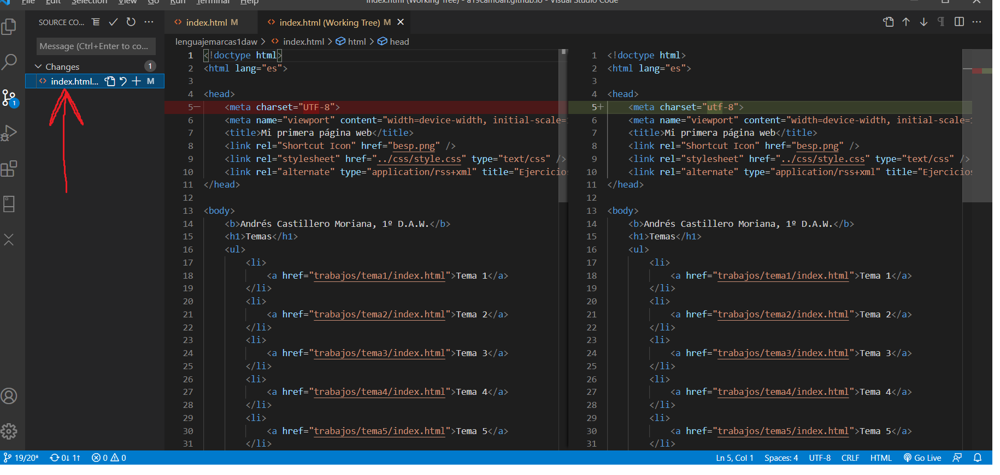
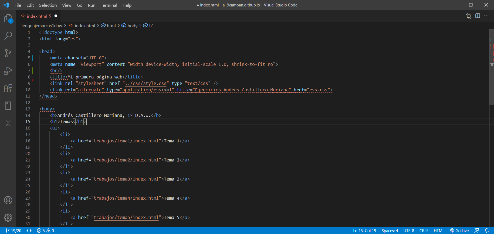

## 1. git add.

El señalado en rojo es para añadir individualmente cada archivo y el azul para todos.

## 2. git commit cerrando un issue.

## 3. git push.

## 4. git checkout -b documentacion.

## 5. git merge.

## 6. git diff.

Doble click ahí.

## 7. git push.

## 8. Colores del margen del editor: rojo, verde, azul.
