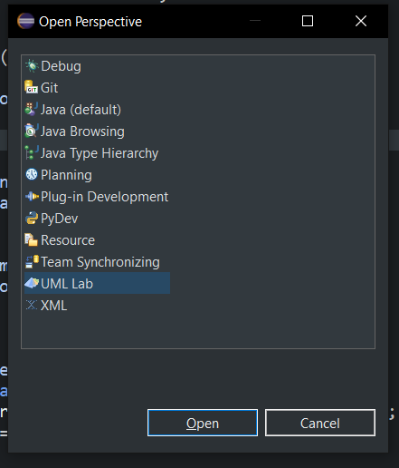
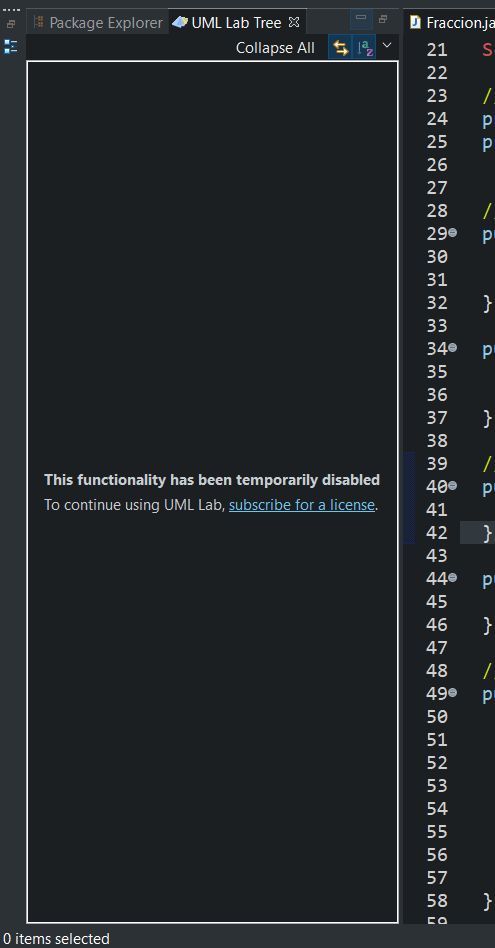
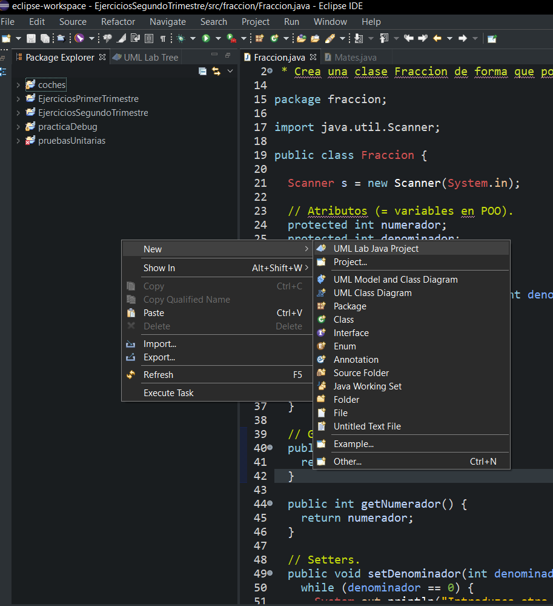
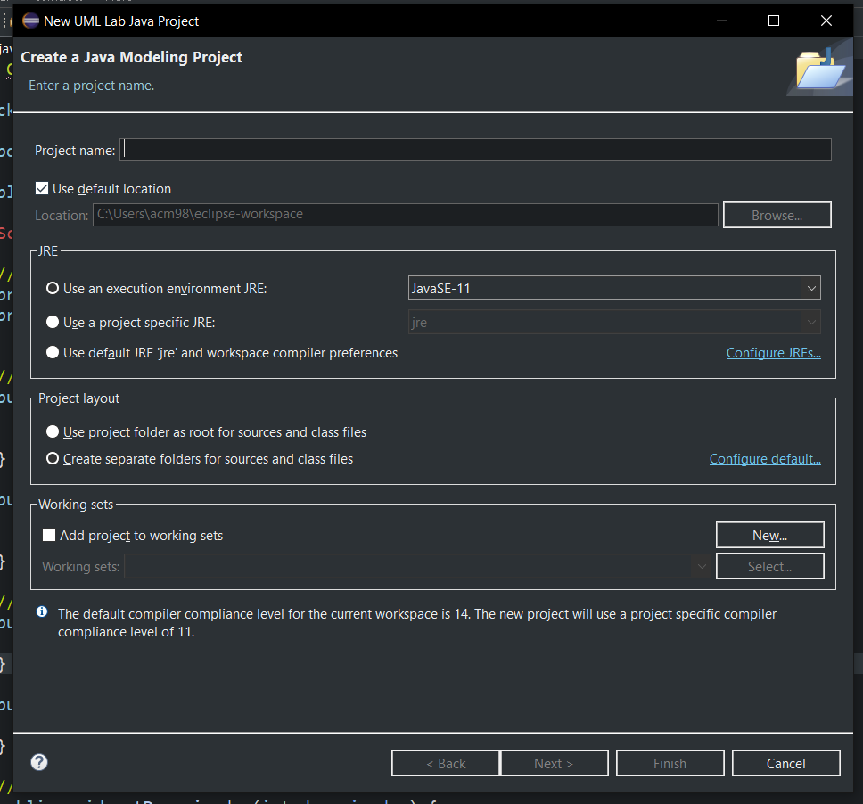
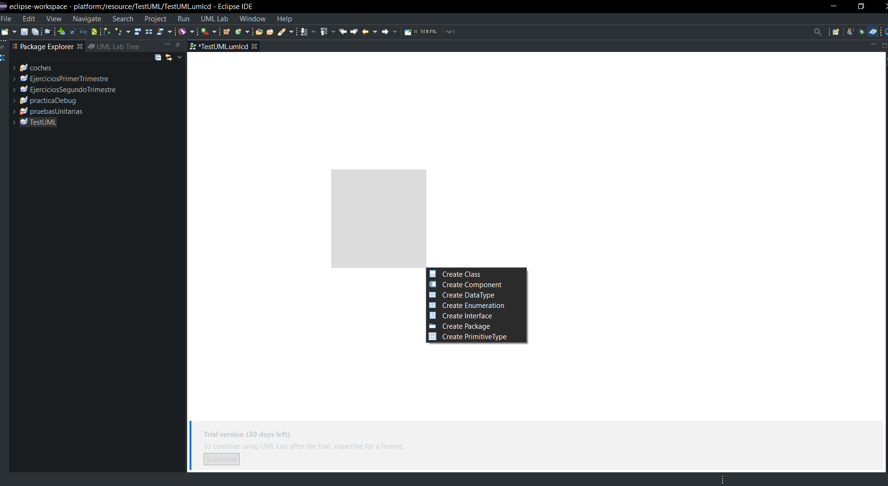
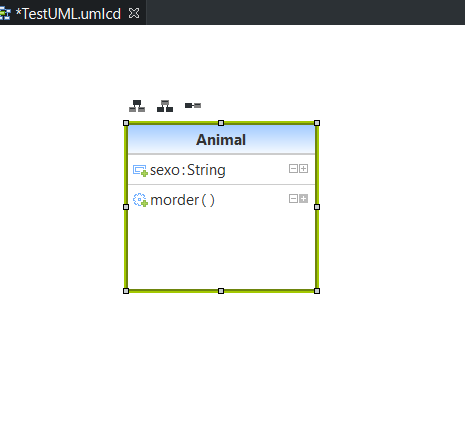
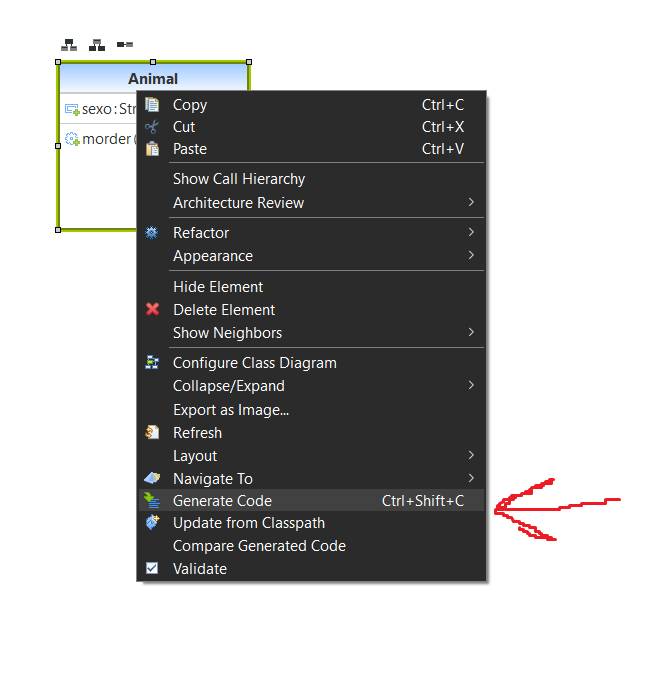
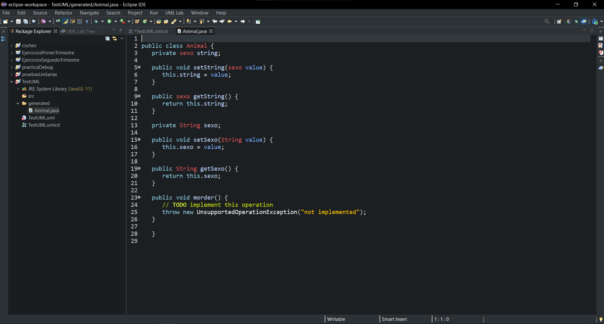

## Nueva perspectiva UML Lab.

## Visualizar UML Lab Tree.

## Cómo crear un proyecto UML Lab de Java.

## Crear una clase con comportamiento y estado (métodos y atributos).

## Generar código de la clase.

## Navegar entre el modelo y el código y viceversa.
