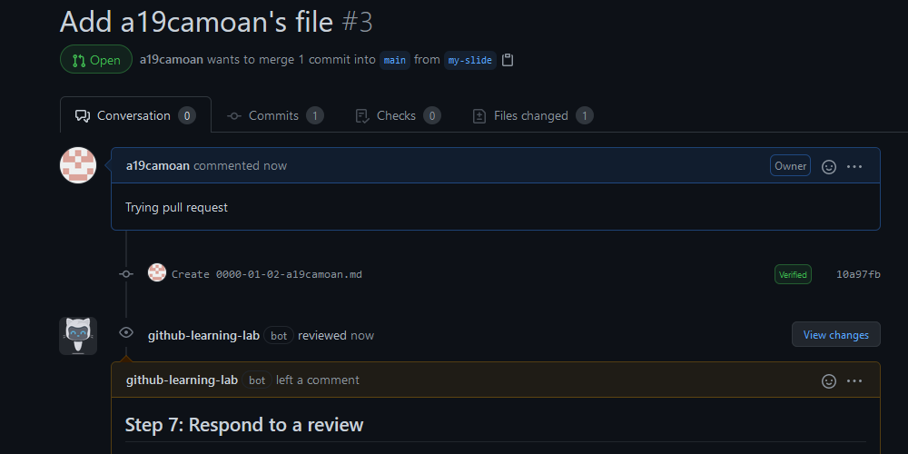

# Tarea 4.2 Introduction to GitHub (parte 2)

## Commit your file to the branch.

## Open a pull request to propose your new file to the codebase.

## Respond to a PR review.

## Make your changes live by merging your PR.

## 1. Envía el enlace del commit e indica si has cumplido con las cuatro reglas de los mensajes del commit indicadas: cómo finaliza, longitud (has usado la descripción extendida?), tiempo verbal y semántica del mensaje

[https://github.com/a19camoan/github-slideshow/commit/10a97fb4cebd2e0aefc8f9b3616c4cacedfc13b1](https://github.com/a19camoan/github-slideshow/commit/10a97fb4cebd2e0aefc8f9b3616c4cacedfc13b1)

## 2. Envía url del fichero que has creado/modificado. Indica en qué carpeta se sitúa  y sobre qué rama has trabajado.

[https://github.com/a19camoan/github-slideshow/blob/my-slide/_posts/0000-01-02-a19camoan.md](https://github.com/a19camoan/github-slideshow/blob/my-slide/_posts/0000-01-02-a19camoan.md)

Rama: "my-slide" Carpeta: "_posts"

## 3. Envía url que te muestre todos tus pull request en el repositorio (filtrado por autor y TODOS, abiertos y cerrados) ¿Por qué te sugiere que realices un pull request?

[https://github.com/a19camoan/github-slideshow/pulls?q=is%3Apr+author%3Aa19camoan+](https://github.com/a19camoan/github-slideshow/pulls?q=is%3Apr+author%3Aa19camoan+)

Porque he realizado un commit.

## 4. ¿Has mencionado a alguien en el pull request?

No

## 5. Envía la url de la nueva diapositiva en el hosting con tu mensaje personalizado

[https://a19camoan.github.io/github-slideshow/#/1](https://a19camoan.github.io/github-slideshow/#/1)

## 6. Envía las urls de los commits realizados en cada rama

[main](https://github.com/a19camoan/github-slideshow/commits/main) // [my-slide](https://github.com/a19camoan/github-slideshow/commits/my-slide)

## 7. Localiza el commit que visualice EXÁCTAMENTE los cambios en la línea 5 (rojo y verde). Deja un comentario con tu nombre y apellidos donde me menciones.

[https://github.com/a19camoan/github-slideshow/commit/55a7843e0f125e2ae95eeea515a77f1b08c8fd00](https://github.com/a19camoan/github-slideshow/commit/55a7843e0f125e2ae95eeea515a77f1b08c8fd00)